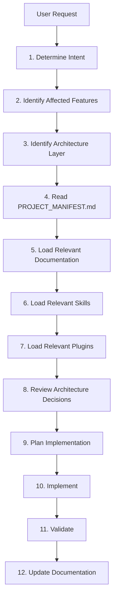

# AI Context Engine — Ascendra

> **Purpose**: Defines the mandatory reasoning workflow for context loading. AI agents must follow this engine to prevent massive, redundant context windows and ensure deterministic decision-making.

---

## 1. The Context Loading Workflow

For every task, you must follow this exact sequence:

## 2. Execution Guidelines

### Do NOT Load Everything
Never `cat` or `view_file` the entire `docs/` directory or multiple unrelated features. Only load what is strictly necessary.

### 1. Determine Intent
Is this a bug fix? A new feature? A UI refactor? A database migration?

### 2. Identify Affected Features
Consult `.ai-core/FEATURE_REGISTRY.md`. If the user asks for "video calls," map that to the `meetings` module. Do not load `tasks` or `dashboard` code unless explicitly connected.

### 3. Identify Architecture Layer
Does this touch UI? Database? Both? Look at `docs/ARCHITECTURE_MAP.md` to see which layers you are allowed to cross.

### 4. Read PROJECT_MANIFEST
If you haven't already, read `PROJECT_MANIFEST.md` to ground yourself in the root rules of the system.

### 5-8. Targeted Knowledge Loading
- Check `.ai-core/KNOWLEDGE_GRAPH.md` to traverse relationships safely.
- Check `.ai-core/SKILL_CATEGORIES.md` and load ONLY the specific `.md` skill files needed (e.g., `riverpod` and `100ms`).
- Activate the relevant plugin from `.ai-core/PLUGIN_DECISION_MATRIX.md`.
- Read `.ai-core/DECISION_HISTORY.md` to ensure you aren't fighting a past architectural decision.

### 9-12. Execution
- Draft a plan using the guidelines in `.ai-core/PLANNING.md`.
- Execute following `.ai-core/FEATURE_LIFECYCLE.md`.
- Ensure all quality gates pass, then automatically trigger `.ai-core/DOC_GENERATION.md` rules.
