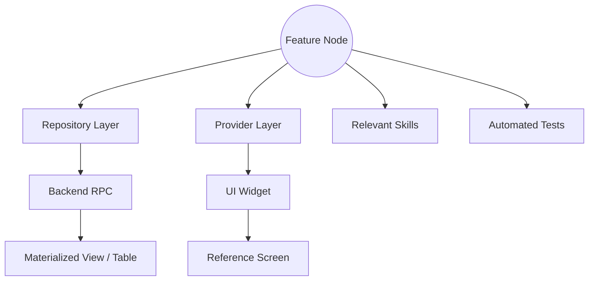

# Knowledge Graph — Ascendra

> **Purpose**: Documents the structural and conceptual relationships between different components. AI agents must use this to traverse the codebase logically, rather than guessing based on folder names.

---

## 1. Feature Node Relationships

When investigating a feature, traverse the graph vertically:



## 2. Structured Graph Representation

For automated traversal, the knowledge graph maps module relationships. 

```json
{
  "features": {
    "members": {
      "repository": "lib/features/members/data/repositories/member_repository.dart",
      "provider": "lib/features/members/presentation/providers/member_profile_provider.dart",
      "rpc": "get_member_profile_view_model",
      "materialized_view": "mv_member_progress",
      "reference_screen": "assets/reference/profile_command_center.png",
      "widgets": "lib/features/members/presentation/widgets/",
      "tests": "test/features/members/",
      "documentation": "docs/MEMBERS_GUIDE.md",
      "skills": ["riverpod", "responsive", "postgresql"]
    },
    "dashboard": {
      "repository": "lib/features/dashboard/data/repositories/dashboard_repository.dart",
      "provider": "lib/features/dashboard/presentation/providers/company_dashboard_provider.dart",
      "rpc": "get_dashboard_view_model",
      "materialized_view": "mv_company_dashboard_stats",
      "reference_screen": "assets/reference/leader_home.png",
      "widgets": "lib/features/dashboard/presentation/widgets/",
      "tests": "test/features/dashboard/",
      "documentation": "docs/ANALYTICS_GUIDE.md",
      "skills": ["riverpod", "charts", "rpc"]
    }
  }
}
```

## 3. Horizontal Relationships

Features do not exist in isolation. The graph connects them:
- **`members`** relies on `mv_member_progress` which is built from `tasks` and `meetings`.
- **`dashboard`** relies on `mv_company_dashboard_stats` which aggregates data from `tasks`, `meetings`, and `profiles`.
- **`tasks`** relies on `storage` for proofs.
- **`meetings`** relies on `100ms` edge functions.
