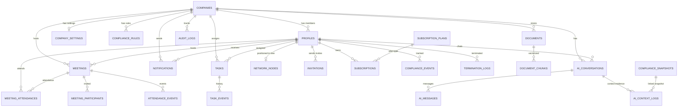

# Ascendra — Database Architecture

> Production-ready PostgreSQL schema for Supabase.
> Designed with skills: `database-architect`, `postgresql`, `database-design`, `database-migration`, `supabase-automation`

---

## Architecture Principles

| Principle | Implementation |
|---|---|
| **UUID primary keys** | `gen_random_uuid()` — globally unique, no sequence conflicts |
| **TIMESTAMPTZ everywhere** | Never use `TIMESTAMP` without timezone |
| **TEXT over VARCHAR** | Use `CHECK (char_length(trim(col)) > 0)` for length constraints |
| **CHECK constraints for enums** | `CHECK (status IN ('active','warned'))` — evolving values, not `CREATE TYPE ENUM` |
| **FK indexes are manual** | PostgreSQL does NOT auto-index foreign keys — add them |
| **Normalize first (3NF)** | Denormalize only for measured, high-ROI reads |
| **RLS on every table** | `ALTER TABLE ... ENABLE ROW LEVEL SECURITY` |
| **Deferrable circular FKs** | For `companies ↔ profiles` circular dependency |
| **`updated_at` triggers** | Automatic via `set_updated_at()` trigger function |
| **Multi-tenant isolation** | `get_user_company_id()` helper for all RLS policies |

---

## Business Context

Ascendra is a **leader-centric MLM management platform**.

- A leader purchases a subscription and manages a limited number of members
- Members do **not** self-register — they are invited by leaders
- Two-axis access control: **ProfileStatus** (identity) × **SubscriptionStatus** (features)

### Onboarding Flow

```
Leader → Invite Member → Create Profile(status='invited')
       → Create Invitation(status='pending')
       → Member accepts invitation → OTP verification
       → Password creation → Supabase auth account linked
       → Profile status → active
       → Invitation status → accepted
```

---

## Entity Relationship Diagram



---

## Status Lifecycles

### Profile Status

```
invited → active → warned → suspended → terminated
                     ↑          ↓
                     └── active ←┘ (reinstated)
```

| Status | Can Login | Can Use Features | Has Auth User |
|---|---|---|---|
| `invited` | ❌ | ❌ | ❌ |
| `active` | ✅ | ✅ | ✅ |
| `warned` | ✅ | ⚠️ Limited | ✅ |
| `suspended` | ✅ | ❌ (renew/billing only) | ✅ |
| `terminated` | ❌ | ❌ | ✅ (disabled) |

### Invitation Status

```
pending → accepted | cancelled | expired
```

All terminal except `pending`.

### Subscription Status

```
active → expired | cancelled
expired → active (renewal)
cancelled → active (re-subscribe)
```

### Meeting Status

```
scheduled → live → ended | cancelled
```

### Task Status

```
open → in_progress → completed | cancelled
```

---

## Migration Files

### Migration Dependency Order

```
001_extensions.sql
002_companies.sql           ← anchor for all company_id FKs (incl. company_settings)
003_profiles.sql            ← references companies, auth.users
004_network_nodes.sql       ← references profiles, company_id
005_subscription_plans.sql  ← seed data, no FKs
006_subscriptions.sql       ← references profiles, subscription_plans
007_invitations.sql         ← references profiles, companies
008_meetings.sql            ← references profiles (leader_id), companies
009_meeting_attendance.sql  ← references meetings, profiles, participants, attendance_events
010_meeting_questions.sql   ← Q&A questions during meetings
011_meeting_answers.sql     ← Q&A answers for questions
012_meeting_recordings.sql  ← meeting replay segments
013_tasks.sql               ← references profiles, companies
014_task_proofs.sql         ← references tasks, profiles, events
015_followups.sql           ← references profiles, companies
016_notifications.sql       ← references profiles, companies, tasks
017_documents.sql           ← references profiles, companies, chunks, products, faqs, stories
018_ai.sql                  ← references profiles, companies, messages, usage logs
019_compliance.sql          ← references profiles, companies, events, snapshots, violations, terminations, restructure logs, audit logs
020_triggers.sql            ← updated_at triggers + validation triggers
021_helper_functions.sql    ← network tree, company creation, vector search functions
022_rls_policies.sql        ← all RLS policies, materialized views, view refresh function
023_ai_context_logs.sql     ← AI forensic debugging: context evidence, skill routing, retrieval audit (Phase F0)
032_ai_skill_routes.sql     ← AI skill router, company patterns, and context cache (Phase F1)
```

---

### 001_extensions.sql

```sql
-- ============================================================================
-- Enable required PostgreSQL extensions
-- ============================================================================

create extension if not exists "uuid-ossp" with schema extensions;
create extension if not exists vector with schema extensions;
create extension if not exists ltree with schema extensions;
```

---

### 002_companies.sql

```sql
-- ============================================================================
-- Companies — The root tenant entity
-- ============================================================================
-- Every record in the system belongs to a company.
-- The owner_id FK to profiles is added as DEFERRABLE because
-- creating a company and its leader profile is a chicken-and-egg problem.

create table if not exists public.companies (
  id         uuid primary key default gen_random_uuid(),
  name       text not null check (char_length(trim(name)) > 0),
  slug       text not null
             check (char_length(trim(slug)) > 0)
             check (slug ~ '^[a-z0-9]([a-z0-9-]*[a-z0-9])?$'),
  owner_id   uuid not null,  -- FK added later (circular dependency with profiles)
  logo_url   text,
  settings   jsonb not null default '{}'::jsonb
             check (jsonb_typeof(settings) = 'object'),
  created_at timestamptz not null default now(),
  updated_at timestamptz not null default now()
);

-- Slug must be unique (case-insensitive)
create unique index if not exists companies_slug_unique_idx
  on public.companies (lower(slug));

-- FK index: owner_id (PostgreSQL does NOT auto-index FKs)
create index if not exists companies_owner_id_idx
  on public.companies (owner_id);

comment on table public.companies is
  'Root tenant entity. All data is scoped to a company.';
comment on column public.companies.owner_id is
  'The leader who created this company. FK deferred for circular insert.';
comment on column public.companies.slug is
  'URL-safe identifier. Lowercase alphanumeric + hyphens only. Unique (case-insensitive).';
comment on column public.companies.settings is
  'Company-level configuration (JSON object). Structured settings in company_settings table.';

-- RLS recommendation:
-- Users can only view their own company:
--   USING (id = public.get_user_company_id())
```

---

### 003_profiles.sql

```sql
-- ============================================================================
-- Profiles — User identity within the organization
-- ============================================================================
-- Maps 1:1 to auth.users AFTER onboarding is complete.
-- Invited profiles exist BEFORE the auth user is created.
-- auth_user_id is nullable because invited profiles don't have one yet.

create table if not exists public.profiles (
  id              uuid primary key default gen_random_uuid(),
  auth_user_id    uuid unique references auth.users(id) on delete set null,
  company_id      uuid not null,  -- FK to companies (deferred)
  distributor_id  text not null check (char_length(trim(distributor_id)) > 0),
  full_name       text not null check (char_length(trim(full_name)) > 0),
  phone           text not null check (char_length(trim(phone)) > 0),
  email           text check (email is null or email ~* '^[^@\s]+@[^@\s]+\.[^@\s]+$'),
  avatar_url      text,
  role            text not null check (role in ('leader', 'member')),
  status          text not null default 'invited'
                  check (status in ('invited', 'active', 'warned', 'suspended', 'terminated')),
  warned_at       timestamptz,
  suspended_at    timestamptz,
  terminated_at   timestamptz,
  created_at      timestamptz not null default now(),
  updated_at      timestamptz not null default now()
);

-- Distributor ID must be unique within a company
create unique index if not exists profiles_company_distributor_unique_idx
  on public.profiles (company_id, lower(distributor_id));

-- Phone must be globally unique (one phone = one person across all companies)
create unique index if not exists profiles_phone_unique_idx
  on public.profiles (phone);

-- FK index: company_id (PostgreSQL does NOT auto-index FKs)
create index if not exists profiles_company_id_idx
  on public.profiles (company_id);

-- Composite index for dashboard queries: "show me active leaders in company X"
create index if not exists profiles_company_role_status_idx
  on public.profiles (company_id, role, status);

-- Index for auth user lookup (login flow)
create index if not exists profiles_auth_user_id_idx
  on public.profiles (auth_user_id)
  where auth_user_id is not null;

-- Circular FK: profiles.company_id → companies.id
-- Added as DEFERRABLE for atomic company creation
alter table public.profiles
  add constraint profiles_company_id_fkey
  foreign key (company_id) references public.companies(id) on delete restrict
  deferrable initially deferred;

-- Circular FK: companies.owner_id → profiles.id
alter table public.companies
  add constraint companies_owner_id_fkey
  foreign key (owner_id) references public.profiles(id) on delete restrict
  deferrable initially deferred;

comment on table public.profiles is
  'User identity. Exists before auth user for invited members.';
comment on column public.profiles.id is
  'Profile UUID — NOT the same as auth.users.id for invited profiles.';
comment on column public.profiles.auth_user_id is
  'Linked after member completes onboarding. NULL for invited profiles.';
comment on column public.profiles.distributor_id is
  'Business identity (like employee number). Unique per company.';
comment on column public.profiles.phone is
  'Globally unique. Used for OTP verification. One phone = one person.';
comment on column public.profiles.status is
  'Lifecycle: invited → active → warned → suspended → terminated';

-- RLS recommendation:
-- Users can view profiles within their company:
--   USING (company_id = public.get_user_company_id())
```

---

### 004_network_nodes.sql

```sql
-- ============================================================================
-- Network Nodes — MLM hierarchy tree
-- ============================================================================
-- Adjacency list with materialized path for tree traversal.
-- Uses ltree extension for efficient ancestor/descendant queries.
-- parent_id = NULL means root node (company leader).

-- Design assumption: This tree represents the MANAGEMENT HIERARCHY
-- (who manages whom), not MLM genealogy (who recruited whom).
-- Tree restructuring on termination is the correct behavior for this model.
-- If the business later requires separate genealogy and management trees,
-- a new table will be needed.

create table if not exists public.network_nodes (
  id              uuid primary key default gen_random_uuid(),
  profile_id      uuid not null unique references public.profiles(id) on delete cascade,
  parent_id       uuid references public.network_nodes(profile_id) on delete set null,
  company_id      uuid not null references public.companies(id) on delete restrict,
  depth           integer not null default 0 check (depth >= 0),
  path            text not null check (char_length(trim(path)) > 0),
  path_ltree      extensions.ltree generated always as (replace(path, '-', '_')::extensions.ltree) stored,
  downline_count  integer not null default 0 check (downline_count >= 0),
  created_at      timestamptz not null default now(),
  updated_at      timestamptz not null default now(),
  -- Prevent self-referencing cycles (node cannot be its own parent)
  check (parent_id is null or parent_id <> profile_id)
);

-- FK index: parent_id for tree traversal joins
create index if not exists network_nodes_parent_id_idx
  on public.network_nodes (parent_id);

-- FK index: company_id
create index if not exists network_nodes_company_id_idx
  on public.network_nodes (company_id);

-- GiST index on ltree for ancestor/descendant queries
create index if not exists network_nodes_path_ltree_gist_idx
  on public.network_nodes using gist (path_ltree);

comment on table public.network_nodes is
  'Management hierarchy tree using adjacency list + materialized path. NOT MLM genealogy.';
comment on column public.network_nodes.path is
  'Dot-separated UUID path from root to this node. E.g. "root-uuid.parent-uuid.this-uuid"';
comment on column public.network_nodes.path_ltree is
  'Auto-generated ltree column for efficient tree queries. Hyphens in UUIDs replaced with underscores.';
comment on column public.network_nodes.depth is
  'Distance from root node (root = 0).';
comment on column public.network_nodes.downline_count is
  'Total descendants (recursive). Updated by triggers/functions.';
comment on column public.network_nodes.parent_id is
  'References network_nodes(profile_id), not profiles(id). Ensures parent is in the tree.';

-- Why ON DELETE SET NULL for parent_id:
-- When a member is terminated, their children get reassigned
-- to the terminated member's parent via restructure_network_tree().
-- SET NULL prevents cascade from deleting the children.

-- Why ON DELETE RESTRICT for company_id:
-- profiles.company_id already uses RESTRICT, so company deletion is blocked.
-- Using RESTRICT here instead of CASCADE for consistency.

-- RLS recommendation:
-- Users can view network nodes for profiles in their company.
```

---

### 005_subscription_plans.sql

```sql
-- ============================================================================
-- Subscription Plans — Plan catalog with feature flags
-- ============================================================================
-- Read-only reference table. Rows added by admin, not by users.
-- No FK dependencies — safe to create early.

create table if not exists public.subscription_plans (
  id                 uuid primary key default gen_random_uuid(),
  name               text not null unique check (char_length(trim(name)) > 0),
  member_limit       integer not null check (member_limit > 0),
  ai_enabled         boolean not null default true,
  analytics_enabled  boolean not null default false,
  price              numeric(10, 2) not null check (price >= 0),
  is_active          boolean not null default true,
  created_at         timestamptz not null default now()
);

-- Seed the three standard plans
insert into public.subscription_plans (name, member_limit, ai_enabled, analytics_enabled, price)
values
  ('Starter',    50,  true, false, 0.00),
  ('Pro',        100, true, true,  0.00),
  ('Enterprise', 200, true, true,  0.00)
on conflict (name) do nothing;

comment on table public.subscription_plans is
  'Plan catalog. Starter(50), Pro(100), Enterprise(200). Extensible for custom plans.';
comment on column public.subscription_plans.member_limit is
  'Max members under this plan. Usage = active + invited profiles.';
comment on column public.subscription_plans.price is
  'Monthly price. Set to 0 during beta. Use NUMERIC(10,2) — never float for money.';
comment on column public.subscription_plans.is_active is
  'False = plan is retired and cannot be selected for new subscriptions.';
```

---

### 006_subscriptions.sql

```sql
-- ============================================================================
-- Subscriptions — Leader ↔ Plan binding
-- ============================================================================
-- Business rules:
--   1. One leader = ONE active subscription (enforced by partial unique index)
--   2. Upgrade allowed (higher member_limit)
--   3. Downgrade blocked (enforced in application layer)
--   4. Expired subscription: user can login but cannot use business features

create table if not exists public.subscriptions (
  id           uuid primary key default gen_random_uuid(),
  leader_id    uuid not null references public.profiles(id) on delete cascade,
  plan_id      uuid not null references public.subscription_plans(id) on delete restrict,
  status       text not null default 'active'
               check (status in ('active', 'expired', 'cancelled')),
  started_at   timestamptz not null default now(),
  expires_at   timestamptz not null,
  renewed_at   timestamptz,
  cancelled_at timestamptz,
  created_at   timestamptz not null default now(),
  updated_at   timestamptz not null default now()
);

-- One active subscription per leader (partial unique index)
-- This is the database-level enforcement of the "one active sub" rule.
create unique index if not exists subscriptions_leader_active_unique_idx
  on public.subscriptions (leader_id)
  where status = 'active';

-- FK index: leader_id
create index if not exists subscriptions_leader_id_idx
  on public.subscriptions (leader_id);

-- FK index: plan_id
create index if not exists subscriptions_plan_id_idx
  on public.subscriptions (plan_id);

-- Index for finding expired subscriptions (cron job)
create index if not exists subscriptions_status_expires_idx
  on public.subscriptions (status, expires_at)
  where status = 'active';

comment on table public.subscriptions is
  'Leader subscription. One active per leader. Controls feature access.';
comment on column public.subscriptions.status is
  'active=paid, expired=billing ended, cancelled=leader cancelled. Separate from profile status.';
comment on column public.subscriptions.expires_at is
  'End of billing period. Cron job marks as expired when past.';

-- Why ON DELETE RESTRICT for plan_id:
-- Never delete a plan that has active subscriptions.
-- Retire plans by setting is_active = false instead.

-- RLS recommendation:
-- Leaders can view their own subscription.
-- Members cannot see subscription details.
```

---

### 007_invitations.sql

```sql
-- ============================================================================
-- Invitations — Leader invites member
-- ============================================================================
-- The entry point for every new member.
-- Creates a profile (status='invited') alongside the invitation.
-- The profile_id links to the pre-created invited profile.

create table if not exists public.invitations (
  id            uuid primary key default gen_random_uuid(),
  inviter_id    uuid not null references public.profiles(id) on delete cascade,
  profile_id    uuid not null references public.profiles(id) on delete cascade,
  company_id    uuid not null references public.companies(id) on delete cascade,
  status        text not null default 'pending'
                check (status in ('pending', 'accepted', 'expired', 'cancelled')),
  invited_at    timestamptz not null default now(),
  expires_at    timestamptz,
  accepted_at   timestamptz,
  cancelled_at  timestamptz
);

-- FK indexes
create index if not exists invitations_inviter_id_idx
  on public.invitations (inviter_id);

create index if not exists invitations_profile_id_idx
  on public.invitations (profile_id);

create index if not exists invitations_company_id_idx
  on public.invitations (company_id);

-- Index for finding pending invitations (plan usage calculation)
create index if not exists invitations_company_status_idx
  on public.invitations (company_id, status)
  where status = 'pending';

-- Index for expiry cron job
create index if not exists invitations_status_expires_idx
  on public.invitations (status, expires_at)
  where status = 'pending' and expires_at is not null;

comment on table public.invitations is
  'Leader-to-member invitation. Creates an invited profile alongside.';
comment on column public.invitations.profile_id is
  'The pre-created profile (status=invited) for the prospective member.';
comment on column public.invitations.inviter_id is
  'The leader who created this invitation.';

-- Why ON DELETE CASCADE for inviter_id and profile_id:
-- If the leader or invited profile is deleted, the invitation is meaningless.

-- RLS recommendation:
-- Leaders can view invitations they created.
-- Members can view their own invitation (by profile_id).
```

---

### 008_meetings.sql

```sql
-- ============================================================================
-- Meetings — Powered by 100ms
-- ============================================================================

create table if not exists public.meetings (
  id                 uuid primary key default gen_random_uuid(),
  company_id         uuid not null references public.companies(id) on delete cascade,
  leader_id          uuid not null references public.profiles(id) on delete cascade,
  title              text not null check (char_length(trim(title)) > 0),
  description        text,
  agenda             text,
  meeting_url        text,
  room_id            text,
  status             text not null default 'scheduled'
                     check (status in ('scheduled', 'live', 'ended', 'cancelled')),
  scheduled_at       timestamptz not null,
  started_at         timestamptz,
  ended_at           timestamptz,
  duration_minutes   integer,
  recording_enabled  boolean not null default false,
  recording_url      text,
  created_at         timestamptz not null default now(),
  updated_at         timestamptz not null default now()
);

-- FK indexes
create index if not exists meetings_company_id_idx
  on public.meetings (company_id);

create index if not exists meetings_leader_id_idx
  on public.meetings (leader_id);

-- Dashboard query: "upcoming meetings for my company"
create index if not exists meetings_company_status_scheduled_idx
  on public.meetings (company_id, status, scheduled_at desc);

-- Leader's meeting list
create index if not exists meetings_leader_status_idx
  on public.meetings (leader_id, status);

comment on table public.meetings is
  'Video meetings powered by 100ms. Recordings expire after 2 days.';
comment on column public.meetings.recording_url is
  'Expires after 2 days per 100ms policy. Application should check expiry.';
```

---

### 009_meeting_attendance.sql

```sql
-- ============================================================================
-- Meeting Attendance — Join/leave tracking
-- ============================================================================

create table if not exists public.meeting_attendances (
  id               uuid primary key default gen_random_uuid(),
  meeting_id       uuid not null references public.meetings(id) on delete cascade,
  profile_id       uuid not null references public.profiles(id) on delete cascade,
  joined_at        timestamptz not null,
  left_at          timestamptz,
  duration_minutes integer,
  attendance_status text not null default 'joined'
                   check (attendance_status in ('joined', 'completed', 'absent')),
  created_at       timestamptz not null default now(),
  unique (meeting_id, profile_id, joined_at)
);

-- FK indexes
create index if not exists meeting_attendances_meeting_id_idx
  on public.meeting_attendances (meeting_id);

create index if not exists meeting_attendances_profile_id_idx
  on public.meeting_attendances (profile_id);

-- Meeting participants (invited members)
create table if not exists public.meeting_participants (
  id          uuid primary key default gen_random_uuid(),
  meeting_id  uuid not null references public.meetings(id) on delete cascade,
  profile_id  uuid not null references public.profiles(id) on delete cascade,
  invited_at  timestamptz not null default now(),
  status      text not null default 'invited'
              check (status in ('invited', 'accepted', 'declined')),
  constraint meeting_participants_unique unique (meeting_id, profile_id)
);

-- Attendance events (granular join/leave/disconnect tracking)
create table if not exists public.attendance_events (
  id            uuid primary key default gen_random_uuid(),
  meeting_id    uuid not null references public.meetings(id) on delete cascade,
  profile_id    uuid not null references public.profiles(id) on delete cascade,
  attendance_id uuid references public.meeting_attendances(id) on delete set null,
  event_type    text not null check (event_type in ('join', 'leave', 'disconnect', 'reconnect')),
  occurred_at   timestamptz not null default now(),
  metadata      jsonb not null default '{}'::jsonb
);

create index if not exists attendance_events_meeting_profile_idx
  on public.attendance_events (meeting_id, profile_id, occurred_at desc);
```

---

### 010_tasks.sql

```sql
-- ============================================================================
-- Tasks — Leader assigns, member completes
-- ============================================================================

create table if not exists public.tasks (
  id           uuid primary key default gen_random_uuid(),
  company_id   uuid not null references public.companies(id) on delete cascade,
  assigned_by  uuid not null references public.profiles(id) on delete cascade,
  assigned_to  uuid not null references public.profiles(id) on delete cascade,
  title        text not null check (char_length(trim(title)) > 0),
  description  text,
  status       text not null default 'open'
               check (status in ('open', 'in_progress', 'completed', 'cancelled')),
  priority     text not null default 'normal'
               check (priority in ('low', 'normal', 'high', 'urgent')),
  due_date     timestamptz,
  completed_at timestamptz,
  created_at   timestamptz not null default now(),
  updated_at   timestamptz not null default now(),
  metadata     jsonb not null default '{}'::jsonb,
  -- Integrity: completed_at must be set if and only if status is 'completed'
  check (
    (status = 'completed' and completed_at is not null)
    or (status <> 'completed' and completed_at is null)
  )
);

-- FK indexes
create index if not exists tasks_assigned_by_idx
  on public.tasks (assigned_by);

-- Dashboard query: "my tasks filtered by status and due date"
create index if not exists tasks_assigned_status_due_idx
  on public.tasks (assigned_to, status, due_date);

-- Leader view: "tasks I created"
create index if not exists tasks_created_by_status_idx
  on public.tasks (assigned_by, status);

-- Company view
create index if not exists tasks_company_status_idx
  on public.tasks (company_id, status);
```

---

### 011_task_proofs.sql

```sql
-- ============================================================================
-- Task Proofs — Member uploads proof of completion
-- ============================================================================

create table if not exists public.task_proofs (
  id           uuid primary key default gen_random_uuid(),
  task_id      uuid not null references public.tasks(id) on delete cascade,
  submitted_by uuid not null references public.profiles(id) on delete cascade,
  proof_type   text not null
               check (proof_type in ('screenshot', 'image', 'document', 'call_log', 'text')),
  file_url     text,
  notes        text,
  submitted_at timestamptz not null default now()
);

-- FK index
create index if not exists task_proofs_task_id_idx
  on public.task_proofs (task_id);

-- Task events (audit trail)
create table if not exists public.task_events (
  id         uuid primary key default gen_random_uuid(),
  task_id    uuid not null references public.tasks(id) on delete cascade,
  actor_id   uuid references public.profiles(id) on delete set null,
  event_type text not null
             check (event_type in ('created', 'assigned', 'started', 'completed', 'cancelled', 'reopened')),
  note       text,
  created_at timestamptz not null default now(),
  metadata   jsonb not null default '{}'::jsonb
);

create index if not exists task_events_task_created_idx
  on public.task_events (task_id, created_at desc);
```

---

### 012_followups.sql

```sql
-- ============================================================================
-- Follow-ups — Leader schedules follow-up reminders
-- ============================================================================

create table if not exists public.followups (
  id             uuid primary key default gen_random_uuid(),
  company_id     uuid not null references public.companies(id) on delete cascade,
  leader_id      uuid not null references public.profiles(id) on delete cascade,
  member_id      uuid not null references public.profiles(id) on delete cascade,
  title          text not null check (char_length(trim(title)) > 0),
  notes          text,
  follow_up_date timestamptz not null,
  status         text not null default 'pending'
                 check (status in ('pending', 'completed', 'missed')),
  created_at     timestamptz not null default now(),
  updated_at     timestamptz not null default now()
);

-- FK indexes
create index if not exists followups_leader_id_idx
  on public.followups (leader_id);

create index if not exists followups_member_id_idx
  on public.followups (member_id);

-- Cron job: find upcoming/missed followups
create index if not exists followups_status_date_idx
  on public.followups (status, follow_up_date)
  where status = 'pending';
```

---

### 013_notifications.sql

```sql
-- ============================================================================
-- Notifications — In-app notifications
-- ============================================================================

create table if not exists public.notifications (
  id           uuid primary key default gen_random_uuid(),
  company_id   uuid not null references public.companies(id) on delete cascade,
  recipient_id uuid not null references public.profiles(id) on delete cascade,
  actor_id     uuid references public.profiles(id) on delete set null,
  task_id      uuid references public.tasks(id) on delete set null,
  type         text not null
               check (type in (
                 'task_assigned', 'task_completed',
                 'compliance_warning', 'compliance_restored', 'compliance_terminated',
                 'invite_accepted', 'invite_sent',
                 'meeting_scheduled', 'meeting_reminder',
                 'subscription_expiring', 'subscription_expired',
                 'system'
               )),
  title        text not null,
  body         text,
  read_at      timestamptz,
  created_at   timestamptz not null default now(),
  metadata     jsonb not null default '{}'::jsonb
);

-- Dashboard query: "my unread notifications, newest first"
create index if not exists notifications_recipient_read_created_idx
  on public.notifications (recipient_id, read_at, created_at desc);

-- Company-wide notifications
create index if not exists notifications_company_created_idx
  on public.notifications (company_id, created_at desc);
```

---

### 014_documents.sql

```sql
-- ============================================================================
-- Documents & Knowledge Base — Product info, FAQs, success stories
-- ============================================================================

create table if not exists public.documents (
  id           uuid primary key default gen_random_uuid(),
  company_id   uuid not null references public.companies(id) on delete cascade,
  uploaded_by  uuid not null references public.profiles(id) on delete cascade,
  title        text not null check (char_length(trim(title)) > 0),
  category     text,
  file_url     text not null,
  file_name    text not null,
  storage_path text not null,
  mime_type    text not null,
  raw_text     text,
  created_at   timestamptz not null default now()
);

-- Document chunks for RAG (pgvector)
create table if not exists public.document_chunks (
  id          uuid primary key default gen_random_uuid(),
  document_id uuid not null references public.documents(id) on delete cascade,
  chunk_text  text not null,
  embedding   vector(768)
);

create index if not exists document_chunks_document_id_idx
  on public.document_chunks (document_id);

-- Products
create table if not exists public.products (
  id          uuid primary key default gen_random_uuid(),
  company_id  uuid not null references public.companies(id) on delete cascade,
  name        text not null check (char_length(trim(name)) > 0),
  description text,
  benefits    text,
  created_at  timestamptz not null default now()
);

-- Product FAQs
create table if not exists public.product_faqs (
  id         uuid primary key default gen_random_uuid(),
  product_id uuid not null references public.products(id) on delete cascade,
  question   text not null,
  answer     text not null,
  created_at timestamptz not null default now()
);

create index if not exists product_faqs_product_id_idx
  on public.product_faqs (product_id);

-- Success Stories
create table if not exists public.success_stories (
  id          uuid primary key default gen_random_uuid(),
  company_id  uuid not null references public.companies(id) on delete cascade,
  title       text not null check (char_length(trim(title)) > 0),
  description text,
  youtube_url text,
  created_at  timestamptz not null default now()
);
```

---

### 015_ai.sql

```sql
-- ============================================================================
-- AI Conversations, Messages & Usage Tracking
-- ============================================================================

create table if not exists public.ai_conversations (
  id         uuid primary key default gen_random_uuid(),
  company_id uuid not null references public.companies(id) on delete cascade,
  profile_id uuid not null references public.profiles(id) on delete cascade,
  title      text,
  created_at timestamptz not null default now(),
  updated_at timestamptz not null default now()  -- Added in 031_ai_context_logs.sql
);

create table if not exists public.ai_messages (
  id              uuid primary key default gen_random_uuid(),
  conversation_id uuid not null references public.ai_conversations(id) on delete cascade,
  role            text not null check (role in ('user', 'assistant', 'system')),
  content         text not null,
  created_at      timestamptz not null default now()
);

create index if not exists ai_messages_conversation_created_idx
  on public.ai_messages (conversation_id, created_at);

-- AI Usage Logs (cost tracking, rate limiting)
create table if not exists public.ai_usage_logs (
  id               uuid primary key default gen_random_uuid(),
  company_id       uuid not null references public.companies(id) on delete cascade,
  profile_id       uuid not null references public.profiles(id) on delete cascade,
  conversation_id  uuid references public.ai_conversations(id) on delete set null,
  message_id       uuid references public.ai_messages(id) on delete set null,
  provider         text not null default 'gemini',
  model            text not null,
  operation        text not null default 'rag_chat',
  prompt_tokens    integer not null default 0 check (prompt_tokens >= 0),
  completion_tokens integer not null default 0 check (completion_tokens >= 0),
  total_tokens     integer not null default 0 check (total_tokens >= 0),
  latency_ms       integer check (latency_ms is null or latency_ms >= 0),
  cost_usd         numeric(12, 6) check (cost_usd is null or cost_usd >= 0),
  created_at       timestamptz not null default now(),
  metadata         jsonb not null default '{}'::jsonb
);

create index if not exists ai_usage_logs_company_created_idx
  on public.ai_usage_logs (company_id, created_at desc);
create index if not exists ai_usage_logs_profile_created_idx
  on public.ai_usage_logs (profile_id, created_at desc);
```

---

### 016_compliance.sql

```sql
-- ============================================================================
-- Compliance — Rules, events, violations, snapshots, termination logs
-- ============================================================================

-- Compliance Rules (one per company)
create table if not exists public.compliance_rules (
  id                                uuid primary key default gen_random_uuid(),
  company_id                        uuid not null unique references public.companies(id) on delete cascade,
  min_attendance_duration_minutes    integer not null default 30,
  min_attendance_count_per_month     integer not null default 4,
  grace_period_days                  integer not null default 7,
  created_at                        timestamptz not null default now()
);

-- Compliance Events (audit trail)
create table if not exists public.compliance_events (
  id         uuid primary key default gen_random_uuid(),
  profile_id uuid not null references public.profiles(id) on delete cascade,
  event_type text not null check (event_type in ('warned', 'warning_removed', 'terminated', 'manual_override')),
  reason     text,
  created_at timestamptz not null default now(),
  metadata   jsonb not null default '{}'::jsonb
);

create index if not exists compliance_events_profile_created_idx
  on public.compliance_events (profile_id, created_at desc);

-- Compliance Snapshots (monthly point-in-time records)
create table if not exists public.compliance_snapshots (
  id                    uuid primary key default gen_random_uuid(),
  company_id            uuid not null references public.companies(id) on delete cascade,
  profile_id            uuid not null references public.profiles(id) on delete cascade,
  period_start          date not null,
  period_end            date not null,
  compliant_meetings    integer not null default 0,
  required_meetings     integer not null default 4,
  total_duration_seconds integer not null default 0,
  status                text not null check (status in ('compliant', 'warned', 'at_risk', 'terminated')),
  evaluated_at          timestamptz not null default now(),
  metadata              jsonb not null default '{}'::jsonb
);

create index if not exists compliance_snapshots_company_period_idx
  on public.compliance_snapshots (company_id, period_start, period_end);
create index if not exists compliance_snapshots_profile_period_idx
  on public.compliance_snapshots (profile_id, period_start desc);

-- Compliance Violations
create table if not exists public.compliance_violations (
  id         uuid primary key default gen_random_uuid(),
  profile_id uuid not null references public.profiles(id) on delete cascade,
  rule_id    uuid not null references public.compliance_rules(id) on delete cascade,
  status     text not null default 'open' check (status in ('open', 'resolved', 'escalated')),
  notes      text,
  created_at timestamptz not null default now()
);

-- Termination Logs
create table if not exists public.termination_logs (
  id                    uuid primary key default gen_random_uuid(),
  profile_id            uuid not null references public.profiles(id) on delete cascade,
  terminated_by         uuid references public.profiles(id) on delete set null,
  reason                text not null,
  notes                 text,
  parent_reassigned_to  uuid references public.profiles(id) on delete set null,
  restructured_at       timestamptz,
  terminated_at         timestamptz not null default now()
);

-- Restructure Logs (tree restructuring audit trail)
create table if not exists public.restructure_logs (
  id                     uuid primary key default gen_random_uuid(),
  company_id             uuid not null references public.companies(id) on delete cascade,
  terminated_profile_id  uuid not null references public.profiles(id) on delete cascade,
  new_parent_id          uuid references public.profiles(id) on delete set null,
  children_moved         integer not null default 0,
  before_tree            jsonb not null default '{}'::jsonb,
  after_tree             jsonb not null default '{}'::jsonb,
  created_at             timestamptz not null default now()
);

-- Audit Logs (comprehensive action audit trail)
create table if not exists public.audit_logs (
  id          uuid primary key default gen_random_uuid(),
  company_id  uuid not null references public.companies(id) on delete cascade,
  actor_id    uuid references public.profiles(id) on delete set null,
  target_id   uuid,
  action      text not null,
  entity_type text not null,
  before_data jsonb,
  after_data  jsonb,
  ip_address  inet,
  user_agent  text,
  created_at  timestamptz not null default now()
);

create index if not exists audit_logs_company_created_idx
  on public.audit_logs (company_id, created_at desc);
create index if not exists audit_logs_actor_created_idx
  on public.audit_logs (actor_id, created_at desc);
create index if not exists audit_logs_entity_action_idx
  on public.audit_logs (entity_type, action, created_at desc);
```

---

### 017_triggers.sql

```sql
-- ============================================================================
-- Triggers — Automatic updated_at
-- ============================================================================

create or replace function public.set_updated_at()
returns trigger
language plpgsql
as $$
begin
  new.updated_at = now();
  return new;
end;
$$;

-- Apply to all tables with updated_at
do $$
declare
  tbl text;
begin
  for tbl in
    select unnest(array[
      'companies', 'profiles', 'subscriptions',
      'tasks', 'meetings', 'followups', 'network_nodes'
    ])
  loop
    execute format(
      'drop trigger if exists set_%s_updated_at on public.%I;
       create trigger set_%s_updated_at
         before update on public.%I
         for each row execute function public.set_updated_at();',
      tbl, tbl, tbl, tbl
    );
  end loop;
end $$;

-- ============================================================================
-- Validation Trigger: subscriptions.leader_id must be a leader-role profile
-- ============================================================================

create or replace function public.validate_subscription_leader()
returns trigger
language plpgsql
as $$
begin
  if not exists (
    select 1 from public.profiles
    where id = new.leader_id and role = 'leader'
  ) then
    raise exception 'subscriptions.leader_id must reference a leader profile';
  end if;
  return new;
end;
$$;

create trigger check_subscription_leader
  before insert or update on public.subscriptions
  for each row execute function public.validate_subscription_leader();

-- ============================================================================
-- Validation Trigger: network_nodes parent must be in the same company
-- ============================================================================

create or replace function public.validate_network_node_company()
returns trigger
language plpgsql
as $$
begin
  if new.parent_id is not null then
    if not exists (
      select 1 from public.network_nodes
      where profile_id = new.parent_id
        and company_id = new.company_id
    ) then
      raise exception 'Parent node must be in the same company';
    end if;
  end if;
  return new;
end;
$$;

create trigger check_network_node_company
  before insert or update on public.network_nodes
  for each row execute function public.validate_network_node_company();
```

---

## Index Strategy Summary

| Table | Index | Purpose |
|---|---|---|
| companies | `(owner_id)` | FK index — PostgreSQL does not auto-index FKs |
| profiles | `(company_id, lower(distributor_id))` UNIQUE | Distributor ID unique per company |
| profiles | `(phone)` UNIQUE | Phone globally unique — one phone = one person |
| profiles | `(company_id, role, status)` | Dashboard filtering |
| subscriptions | `(leader_id) WHERE status='active'` UNIQUE | One active sub per leader |
| subscriptions | `(status, expires_at) WHERE status='active'` | Expiry cron job |
| invitations | `(company_id, status) WHERE status='pending'` | Plan usage calculation |
| network_nodes | `USING gist (path_ltree)` | Tree traversal queries |
| meetings | `(company_id, status, scheduled_at DESC)` | Dashboard upcoming meetings |
| tasks | `(assigned_to, status, due_date)` | Member task list |
| notifications | `(recipient_id, read_at, created_at DESC)` | Unread notifications |

---

## Scale Targets

| Metric | Target |
|---|---|
| Total users | 100,000+ |
| Companies | 1,000+ |
| Members per company | Up to 200 (Enterprise plan) |
| Meetings per company/month | ~30 |
| Tasks per company/month | ~500 |
| AI conversations per user | ~100 |

---

## Key Design Decisions

### 1. Profiles.id ≠ auth.users.id

Profiles have their own UUID. The `auth_user_id` column links to `auth.users` **after** onboarding. This allows invited profiles to exist before the Supabase auth user is created.

### 2. Circular FK: companies ↔ profiles

Solved with `DEFERRABLE INITIALLY DEFERRED` constraints. The `create_company_atomic()` function inserts both in one transaction.

### 3. Two-Axis Access Control

`ProfileStatus` and `SubscriptionStatus` are independent:
- Profile controls **identity** (can you log in?)
- Subscription controls **features** (can you use the platform?)

### 4. Plan Usage = Active + Invited

Invitations consume plan slots immediately. This prevents leaders from gaming the system by over-inviting.

### 5. Downgrade Blocked

Enforced in application layer, not database. The database allows any plan change — the use case validates direction.

### 6. Globally Unique Phone Numbers

Phone numbers are unique across ALL companies, not just within a company. Rationale:
- Phone is used for OTP verification — it maps to a real person
- Prevents duplicate identity across companies
- If multi-company membership is added later, the same profile is linked (not duplicated)

### 7. Network Tree = Management Hierarchy

The `network_nodes` table models **who manages whom**, not MLM genealogy (who recruited whom). Tree restructuring on termination is correct for this model. If the business later requires separate genealogy tracking, a new table will be added.

### 8. Subscription Leader Validation

A trigger on `subscriptions` validates that `leader_id` references a profile with `role = 'leader'`. This cannot be done with a CHECK constraint (cross-table reference).

### 9. ON DELETE Behaviors

| FK | ON DELETE | Reason |
|---|---|---|
| profiles → companies | RESTRICT | Never orphan a company |
| companies → profiles (owner) | RESTRICT | Never delete a company owner |
| subscriptions → plans | RESTRICT | Never delete an active plan |
| invitations → profiles | CASCADE | Invitation is meaningless without the profile |
| tasks → profiles (assigned_to) | CASCADE | Tasks are tied to the member |
| network_nodes → profiles (profile_id) | CASCADE | Delete profile = delete node |
| network_nodes → network_nodes (parent_id) | SET NULL | Allow tree restructuring |
| network_nodes → companies | RESTRICT | Consistent with profiles — block company deletion |
| notifications → profiles (actor) | SET NULL | Keep notification even if actor deleted |

