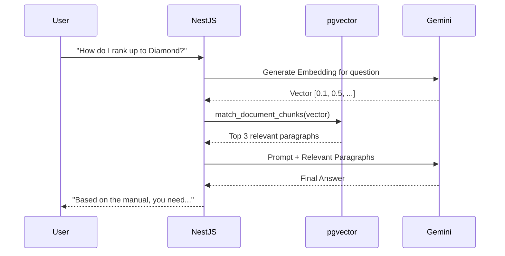

# AI Assistant Guide — Ascendra

> **Purpose**: Architecture and workflow for the AI Leadership Coach (RAG + Gemini).

---

## 1. The Goal

The AI Assistant acts as an executive coach for MLM leaders. It answers questions based on:
1. The company's uploaded PDFs/documents (compensation plans, training manuals).
2. The leader's actual downline data (who is struggling, who missed meetings).

## 2. Architecture (RAG pipeline)

Ascendra implements Retrieval-Augmented Generation (RAG) using `pgvector` and Google Gemini.



## 3. Ingestion Process

When a leader uploads a document (Knowledge Base):
1. The document is stored in Supabase Storage (`knowledge_base` bucket).
2. A NestJS worker parses the text and splits it into chunks.
3. The worker generates embeddings for each chunk using an embedding model.
4. The chunks and vectors are saved to the `knowledge_chunks` table in PostgreSQL.

## 4. Chat Interface (Flutter)

The Flutter chat interface is relatively simple.

1. It maintains a list of `ai_messages`.
2. When the user sends a message, it posts to the NestJS `/chat` endpoint.
3. It displays a typing indicator while waiting for the response.
4. It streams the response back from the server (if Server-Sent Events are enabled) or waits for the full block.

### Context Awareness
To make the AI aware of the user's specific context, Flutter passes the current screen or selected member ID in the request payload.

```dart
// Request payload
{
  "message": "Why is John struggling?",
  "context": {
    "screen": "member_profile",
    "profile_id": "D005"
  }
}
```
NestJS uses this to fetch John's compliance data and inject it into the Gemini prompt automatically.
