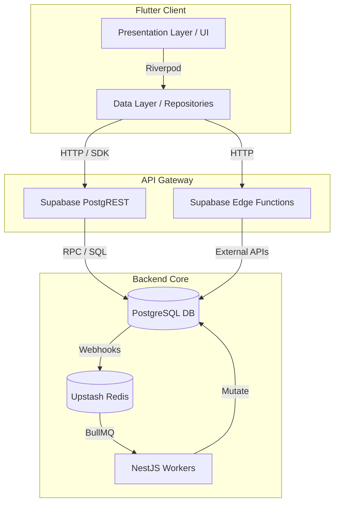

# Architecture Map — Ascendra

> **Purpose**: Defines layer ownership, dependency directions, and allowed/forbidden interactions across the entire stack.

---

## 1. System Map

## 2. Layer Rules

### Presentation Layer (Flutter)
- **Owner**: Flutter Engineer, UI/UX Engineer
- **Allowed Interactions**: Can read from `Providers`. Can call methods on `Notifier` or `Controller` classes.
- **Forbidden Interactions**: Cannot call `Supabase.instance...` directly. Cannot mutate data without going through a Controller.

### Data Layer (Flutter)
- **Owner**: Flutter Engineer
- **Allowed Interactions**: Can call PostgREST APIs and Edge Functions. Can parse JSON into `Freezed` models.
- **Forbidden Interactions**: Cannot import `dart:ui` or `flutter/material.dart`. Must remain pure Dart (or rely only on network packages).

### API Gateway (Supabase)
- **Owner**: Backend Engineer, Database Architect
- **Allowed Interactions**: Resolves auth, enforces RLS, routes RPC calls.
- **Forbidden Interactions**: Edge Functions should not run complex aggregations (use PostgreSQL Materialized Views or NestJS instead).

### Backend Core
- **Owner**: Backend Engineer, Database Architect
- **Allowed Interactions**: PostgreSQL triggers can push events to Redis. NestJS consumes Redis queues to perform heavy background tasks (AI RAG, Compliance evaluation).
- **Forbidden Interactions**: NestJS should not render HTML or serve client assets. It is strictly an asynchronous worker.

## 3. Strict Dependency Direction

Dependencies flow **DOWNWARD** only.

1. `Presentation` depends on `Data`.
2. `Data` depends on `API Gateway`.
3. `API Gateway` depends on `Backend Core`.

**Violation Example**: The `Data` layer cannot pass a `BuildContext` (Presentation) down into a repository.
