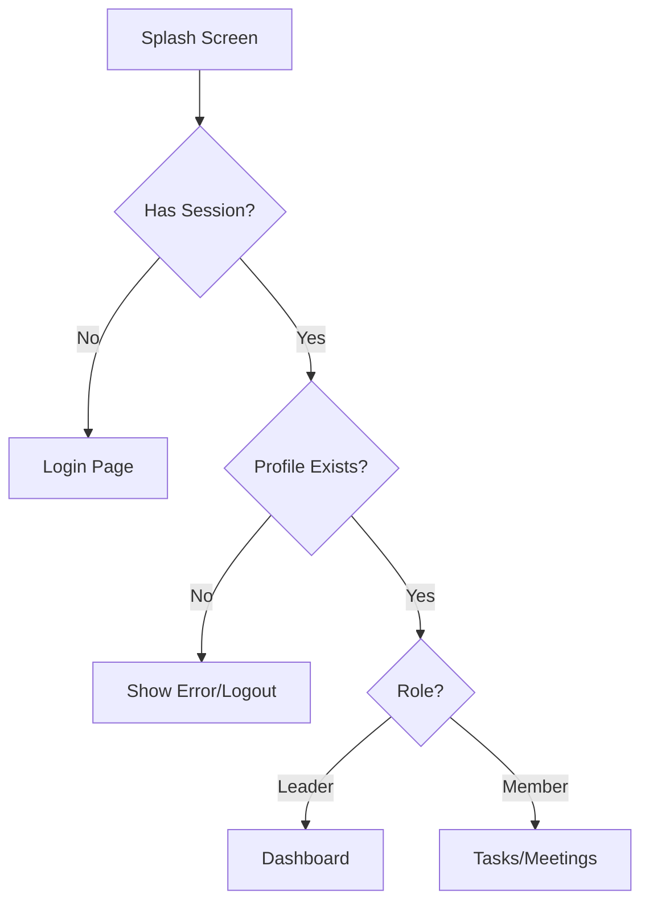

# Authentication Guide — Ascendra

> **Purpose**: Describes the authentication flows and session management within the Flutter client.

---

## 1. Authentication Strategy

Ascendra uses **Supabase Auth (GoTrue)** for all authentication. 

Because Ascendra is an invitation-only platform, there is no public registration (Sign Up) flow. Users can only log in if they have been invited by a leader and have completed the OTP verification.

## 2. Session Management

We use `flutter_secure_storage` to encrypt and store the Supabase session token locally. This is configured during Supabase initialization.

```dart
// lib/core/config/secure_local_storage.dart
class SecureLocalStorage extends LocalStorage {
  final FlutterSecureStorage _storage = const FlutterSecureStorage();
  
  // Implementation of initialize, hasAccessToken, accessToken, removePersistedSession
}
```

## 3. The Bootstrap Flow

When the app launches, it must determine whether the user is logged in and route them accordingly. This is handled by the `bootstrapProvider`.



This logic lives in `lib/app/bootstrap/bootstrap_provider.dart`.

## 4. Login Flow

Users log in using their **Distributor ID** and **Password**. 

Because Supabase Auth expects an email or phone number, we use an RPC to resolve the Distributor ID to the underlying Auth UID or email before calling `signInWithPassword`.

```dart
// 1. Resolve ID
final email = await _client.rpc('resolve_distributor_login', params: {
  'p_distributor_id': distributorId
});

// 2. Sign In
await _client.auth.signInWithPassword(
  email: email,
  password: password,
);
```

## 5. Routing Guards

GoRouter uses the auth state to redirect users automatically if their session expires or if they try to access a protected route without logging in.

```dart
// lib/app/Router/app_router.dart
redirect: (context, state) {
  final isLoggedIn = authState.value != null;
  final isLoggingIn = state.matchedLocation == '/login';

  if (!isLoggedIn && !isLoggingIn) return '/login';
  if (isLoggedIn && isLoggingIn) return '/dashboard';

  return null;
},
```

## 6. Token Refresh

Supabase Auth automatically handles refreshing the JWT before it expires. The Flutter client does not need to manually implement token refresh logic. If the refresh token expires (e.g., user is offline for weeks), the `onAuthStateChange` stream will emit an unauthenticated state, and GoRouter will redirect them to the login screen.
