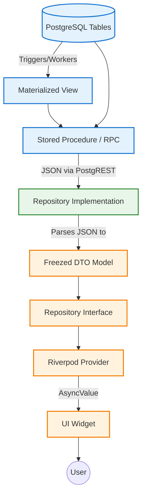
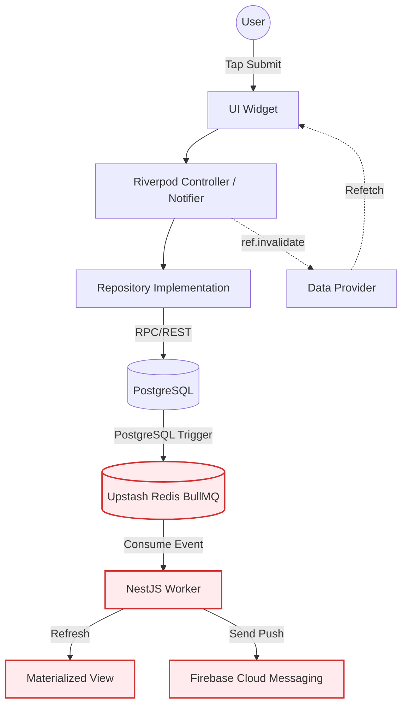

# Dependency Graph — Ascendra

> **Purpose**: A visual map of how data flows through the Ascendra architecture, from the database up to the UI.

---

## 1. The Core Data Flow (Reads)

When Flutter needs to display aggregated data (like a dashboard or a member profile), it follows this strict unidirectional dependency chain:

### Example: Dashboard Flow
1. **Widget**: `LeaderDashboardPage` calls `ref.watch(companyDashboardProvider)`.
2. **Provider**: `companyDashboardProvider` calls `ref.watch(dashboardRepositoryProvider).getDashboardStats()`.
3. **Repository**: `DashboardRepositoryImpl` executes `Supabase.instance.client.rpc('get_dashboard_view_model')`.
4. **RPC**: `get_dashboard_view_model()` reads from `mv_company_dashboard_stats`.
5. **Database**: `mv_company_dashboard_stats` contains pre-calculated aggregates derived from `tasks`, `meetings`, and `profiles`.

## 2. The Core Data Flow (Writes / Mutations)

When a user performs an action (like completing a task), it follows an event-driven flow:

### Example: Completing a Task
1. **Widget**: User taps "Submit Proof".
2. **Controller**: `TaskController.submitProof()` is called.
3. **Repository**: Uploads file to Storage, then calls `submit_task_proof` RPC.
4. **Database**: RPC updates `task_assignments` to `pending_review`.
5. **Event**: A database trigger fires a webhook to Redis (`TaskProofSubmitted`).
6. **Worker**: NestJS consumes the event, evaluates rules, and updates `mv_member_progress`.
7. **Flutter UI**: The `TaskController` invalidates the `taskListProvider`, forcing the UI to refetch the updated task list.
