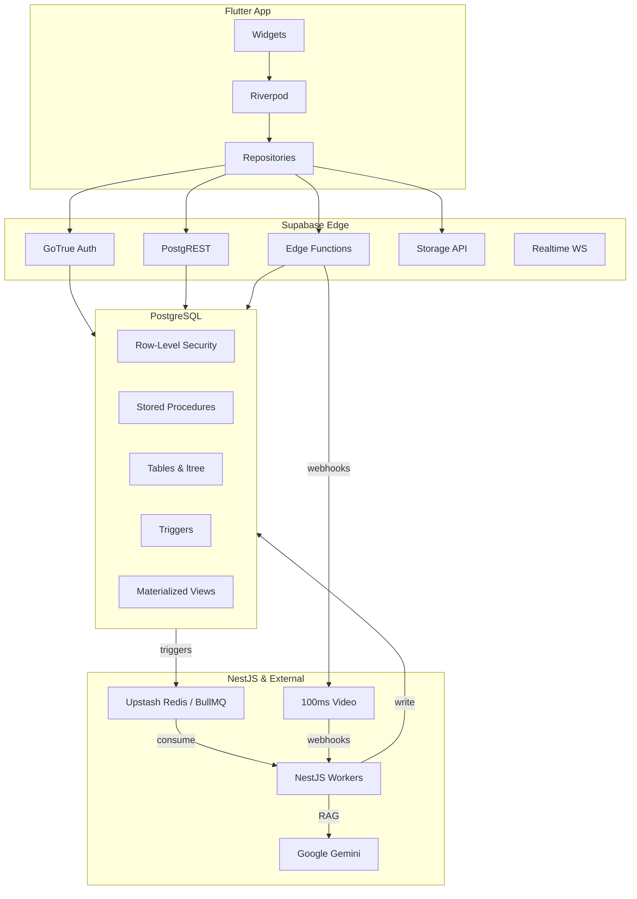
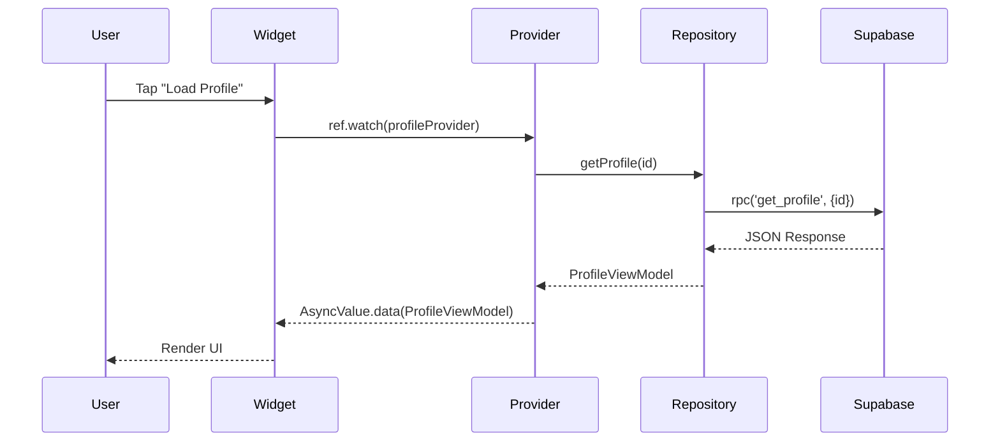

# Project Architecture — Ascendra

> **Purpose**: A high-level view of how Ascendra's systems fit together. This is a technical expansion of the architectural diagram found in `AGENTS.md`.

---

## 1. High-Level System Architecture

Ascendra is an event-driven system heavily reliant on the backend for orchestration, intelligence, and business logic. Flutter acts purely as a presentation layer.



## 2. Flutter Clean Architecture

The Flutter client strictly follows Clean Architecture with a unidirectional data flow.

### Layers

1. **Presentation (`lib/features/<name>/presentation/`)**
   - Pages, Widgets, Providers
   - No business logic. Formats and displays data.
2. **Domain (`lib/features/<name>/domain/`)**
   - Abstract repositories, Entities (Freezed models)
   - Defines what the app can do, completely isolated from implementation details.
3. **Data (`lib/features/<name>/data/`)**
   - Repository implementations, Supabase client calls.
   - Parses JSON into Freezed models.

### Data Flow Pattern



## 3. Database Architecture

### Row-Level Security (RLS)

Ascendra is a multi-tenant platform. Tenant isolation is achieved exclusively through PostgreSQL RLS. Every policy relies on the `get_user_company_id()` helper.

```sql
create policy "Company isolation"
  on public.tasks
  for select
  using (company_id = public.get_user_company_id());
```

### The ltree Hierarchy

The MLM structure is modeled using the `ltree` extension. Every `network_nodes` row has a `path` column (e.g., `ROOT.D001.D005.D012`).

This allows instantaneous queries like:
- "Find all descendants of D005": `path ~ '*.D005.*'`
- "Find upline to ROOT": `path @> 'ROOT.D001.D005.D012'`

### Analytics Engine

Flutter never computes metrics. Instead:
1. Domain events occur (e.g., `TaskCompleted`).
2. NestJS processes the event and updates raw tables.
3. NestJS triggers a refresh of Materialized Views (`mv_company_dashboard_stats`).
4. Flutter queries the Materialized View via RPC.

## 4. Business Logic Ownership

| Layer | Responsibility | Examples |
|-------|----------------|----------|
| **PostgreSQL** | Atomic transactions, data integrity, path calculations, vector similarity | `create_company_atomic()`, `restructure_network_tree()` |
| **Edge Functions** | Stateless 3rd-party integrations, < 15s execution | Create 100ms room, Send SMS OTP |
| **NestJS** | Evolving business rules, compliance evaluation, AI orchestration | `evaluate_compliance()`, `generate_ai_summary()` |
| **Flutter** | UI rendering, validation, navigation | Form validation, Router guards |

---

*For detailed API mapping, refer to [API_REFERENCE.md](API_REFERENCE.md).*
