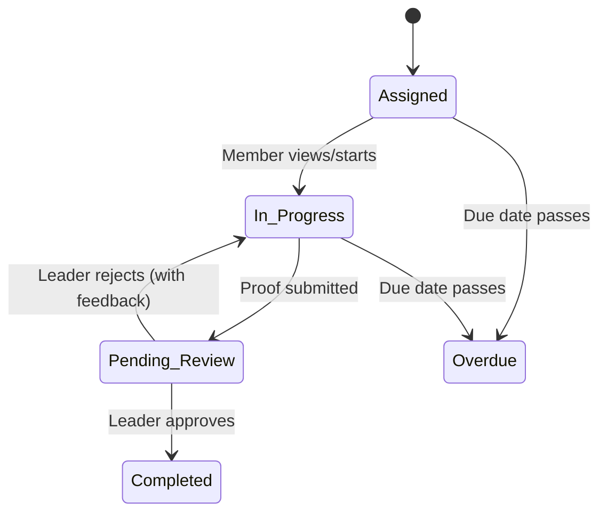

# Tasks Guide — Ascendra

> **Purpose**: Overview of the task assignment, proof submission, and review workflow.

---

## 1. Task Lifecycle

## 2. Data Model

- **`tasks`**: The definition of the work (Title, description, point value, due date).
- **`task_assignments`**: Links the task to specific members. Holds the status.
- **`task_proofs`**: Evidence submitted by the member.
- **`task_followups`**: "Nudges" sent by leaders to remind members.

## 3. Proof Submission

Ascendra requires proof for a task to enter `pending_review`.

### Supported Types
1. **Text**: A written response.
2. **URL**: A link to a social media post, document, etc.
3. **Image**: Uploaded via `image_picker` to Supabase Storage (`task_proofs` bucket).
4. **PDF**: Uploaded via `file_picker` to Supabase Storage.

Flutter handles the upload, retrieves the path, and then calls the `submit_task_proof` RPC with the path.

## 4. Leader Review

When a task is `pending_review`, it appears in the leader's Task Command Center.
- **Approve**: Updates assignment status to `completed`. Adds points to the member's compliance score.
- **Reject**: Updates status back to `in_progress`. Requires leader feedback (e.g., "Image is blurry, please retake").

## 5. Event Triggers (BullMQ)

When a task is completed, an event is published to Redis:
`TaskCompleted { task_id, profile_id, points }`

NestJS consumes this event to:
1. Update the member's compliance snapshot.
2. Send a congratulatory push notification.
3. Update the `mv_company_dashboard_stats` materialized view.
