# Ascendra Entity Relationship (ER) Diagram

This document details the database schema, entity relationships, indexes, and foreign key cascade rules of the Ascendra backend.

---

## 1. Entity Relationship Diagram

The diagram below shows the relationships between entities in the Ascendra PostgreSQL database.

```mermaid
erDiagram
    %% Core Entities
    COMPANIES ||--o{ PROFILES : "has members"
    COMPANIES ||--o| COMPLIANCE_RULES : "defines compliance rules"
    COMPANIES ||--o{ MEETINGS : "hosts video meetings"
    COMPANIES ||--o{ DOCUMENTS : "stores knowledge base docs"
    COMPANIES ||--o{ TASKS : "assigns work tasks"
    COMPANIES ||--o{ AI_CONVERSATIONS : "has conversation threads"
    COMPANIES ||--o{ AUDIT_LOGS : "logs system operations"
    COMPANIES ||--o{ ALERT_RULES : "defines metric thresholds"

    PROFILES ||--o| NETWORK_NODES : "positioned in network tree"
    PROFILES ||--o{ INVITATIONS : "sends invitations"
    PROFILES ||--o{ SUBSCRIPTIONS : "owns subscriptions"
    PROFILES ||--o{ MEETINGS : "hosts meetings"
    PROFILES ||--o{ MEETING_ATTENDANCES : "logs attendance"
    PROFILES ||--o{ TASKS : "assigned tasks to complete"
    PROFILES ||--o{ AI_CONVERSATIONS : "chats with assistant"
    PROFILES ||--o{ COMPLIANCE_EVENTS : "compliance alerts"
    PROFILES ||--o{ COMPLIANCE_SNAPSHOTS : "snapshots compliance history"
    PROFILES ||--o{ TERMINATION_LOGS : "terminated status history"

    SUBSCRIPTION_PLANS ||--o{ SUBSCRIPTIONS : "determines plan limits"

    %% Meetings
    MEETINGS ||--o{ MEETING_ATTENDANCES : "tracks user duration"
    MEETINGS ||--o{ MEETING_PARTICIPANTS : "registers invited members"
    MEETINGS ||--o{ ATTENDANCE_EVENTS : "captures join/leave stream"

    %% Tasks
    TASKS ||--o{ TASK_PROOFS : "submits proof verification"
    TASKS ||--o{ TASK_EVENTS : "logs status transitions"

    %% Documents & AI
    DOCUMENTS ||--o{ DOCUMENT_CHUNKS : "split for vector search"
    AI_CONVERSATIONS ||--o{ AI_MESSAGES : "contains text messages"
    AI_CONVERSATIONS ||--o{ AI_CONTEXT_LOGS : "stores forensic context"
    AI_CONVERSATIONS ||--o{ AI_USAGE_LOGS : "tracks cost and latency"

    %% Alerting
    ALERT_RULES ||--o{ ALERTS : "triggers alerts"
    ALERTS ||--o{ ALERT_DELIVERIES : "tracks channel status"
    PROFILES ||--o{ ALERT_PREFERENCES : "configures options"
    PROFILES ||--o{ ALERTS : "assigned notifications"
```



---

## 2. Table Definitions

### A. Identity & Tenancy
- **`companies`**: Root tenant records.
  - `id` (UUID, PK)
  - `name` (TEXT, check length > 0)
  - `slug` (TEXT, unique check safe-url format)
  - `owner_id` (UUID, FK profiles, deferred circular check)
- **`profiles`**: Multi-tenant users (invited, active, warned, suspended, terminated).
  - `id` (UUID, PK)
  - `auth_user_id` (UUID, FK auth.users, unique nullable)
  - `company_id` (UUID, FK companies, deferred circular check)
  - `distributor_id` (TEXT, unique lower key per company)
  - `role` (TEXT, check role in `'leader'`, `'member'`)
  - `status` (TEXT, check status lifecycle constraints)
  - `search_vector` (TSVECTOR, generated for full-text search)
- **`network_nodes`**: The materialized MLM structure path.
  - `id` (UUID, PK)
  - `profile_id` (UUID, FK profiles, unique)
  - `parent_id` (UUID, FK network_nodes.profile_id)
  - `company_id` (UUID, FK companies)
  - `path` (TEXT, dot-separated ancestor path)
  - `path_ltree` (LTREE, generated path replacing '-' with '_')
  - `downline_count` (INTEGER, count of child nodes)

### B. Plans & Billing
- **`subscription_plans`**: Catalogs plan limits.
  - `id` (UUID, PK)
  - `name` (TEXT, unique Starter/Pro/Enterprise)
  - `member_limit` (INTEGER limit of active + invited slots)
  - `price` (NUMERIC, monthly amount)
- **`subscriptions`**: Connects leaders to plans.
  - `id` (UUID, PK)
  - `leader_id` (UUID, FK profiles)
  - `plan_id` (UUID, FK subscription_plans)
  - `status` (TEXT, check status in `'active'`, `'expired'`, `'cancelled'`)

### C. Meetings & Operations
- **`meetings`**: Managed rooms synchronized with 100ms API.
  - `id` (UUID, PK)
  - `company_id` (UUID, FK companies)
  - `leader_id` (UUID, FK profiles)
  - `status` (TEXT, check status in `'scheduled'`, `'live'`, `'ended'`, `'cancelled'`)
  - `room_id` (TEXT, external meeting room ID)
- **`meeting_attendances`**: Join and leave logs.
  - `id` (UUID, PK)
  - `meeting_id` (UUID, FK meetings)
  - `profile_id` (UUID, FK profiles)
  - `duration_minutes` (INTEGER)
- **`tasks`**: Tasks assigned by leaders to members.
  - `id` (UUID, PK)
  - `company_id` (UUID, FK companies)
  - `assigned_by` (UUID, FK profiles)
  - `assigned_to` (UUID, FK profiles)
  - `status` (TEXT, check status in `'open'`, `'in_progress'`, `'completed'`, `'cancelled'`)
  - `search_vector` (TSVECTOR, generated for search queries)

---

## 3. Database Indexing Strategy

To speed up multi-tenant lookups, hierarchical traversals, and search queries, the system uses these indexes:

| Table | Index Columns | Index Type | Purpose |
|---|---|---|---|
| `companies` | `lower(slug)` | UNIQUE | Ensures safe URL slugs are case-insensitive and unique. |
| `profiles` | `(company_id, lower(distributor_id))` | UNIQUE | distributor_id is unique within a company. |
| `profiles` | `(phone)` | UNIQUE | Ensures phone numbers are globally unique for OTP login. |
| `profiles` | `search_vector` | GIN | Enables fast full-text searching over profiles. |
| `profiles` | `(full_name)` | GIN (trgm) | Supports partial name lookups (e.g. typing "Jo" for "John"). |
| `network_nodes`| `(path_ltree)` | GiST | Fast index for downline traversal queries using `@>` and `<@`. |
| `subscriptions`| `(leader_id) WHERE status='active'` | UNIQUE | Enforces rule: "one active subscription per leader." |
| `alerts` | `(alert_hash)` | UNIQUE | Deduplicates automated alerts to prevent duplicate notifications. |
| `ai_context_logs`| `(retrieved_document_ids)` | GIN | Enables searching for context logs linked to a document. |
| `ai_context_logs`| `(context_snapshot)` | GIN | Enables searching nested fields in context snapshot logs. |
| `tasks` | `search_vector` | GIN | Supports text search queries on tasks. |

---

## 4. Foreign Key Constraints & Cascade Policies

To maintain referential integrity without manual cleanup, the backend uses these foreign key delete rules:

```
                  ┌──────────────────────┐
                  │      COMPANIES       │
                  └──────────┬───────────┘
                             │
            ┌────────────────┼────────────────┐
       RESTRICT (owner)      │                │
            │                ▼                ▼
   ┌────────┴────────┐  ON DELETE CASCADE   ON DELETE RESTRICT
   │    PROFILES     │◄─────────────────    (company_id)
   └────────┬────────┘    (company_id)        │
            │                                 │
    ON DELETE CASCADE                         │
            │                                 ▼
            ▼                       ┌──────────────────┐
   ┌─────────────────┐              │  NETWORK_NODES   │
   │  NETWORK_NODES  │              └──────────────────┘
   └─────────────────┘
      (profile_id)
```

- **`ON DELETE CASCADE`**:
  - **`network_nodes.profile_id` ➔ `profiles.id`**: Deleting a profile automatically deletes its network tree node.
  - **`invitations.profile_id` ➔ `profiles.id`**: If an invited profile is deleted, the corresponding invitation is deleted.
  - **`meetings.company_id` ➔ `companies.id`**: Deleting a company automatically deletes all its meetings.
- **`ON DELETE RESTRICT`**:
  - **`profiles.company_id` ➔ `companies.id`**: Prevents deleting a company if it has profiles.
  - **`companies.owner_id` ➔ `profiles.id`**: Prevents deleting a profile if they own a company.
  - **`subscriptions.plan_id` ➔ `subscription_plans.id`**: Prevents deleting subscription plans that have active billing entries.
- **`ON DELETE SET NULL`**:
  - **`network_nodes.parent_id` ➔ `network_nodes.profile_id`**: Allows tree restructuring without deleting descendant nodes.
  - **`termination_logs.terminated_by` ➔ `profiles.id`**: Keeps termination records even if the leader who deleted them is removed from the system.
