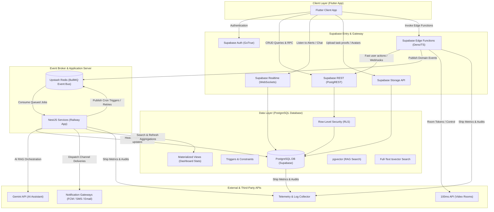
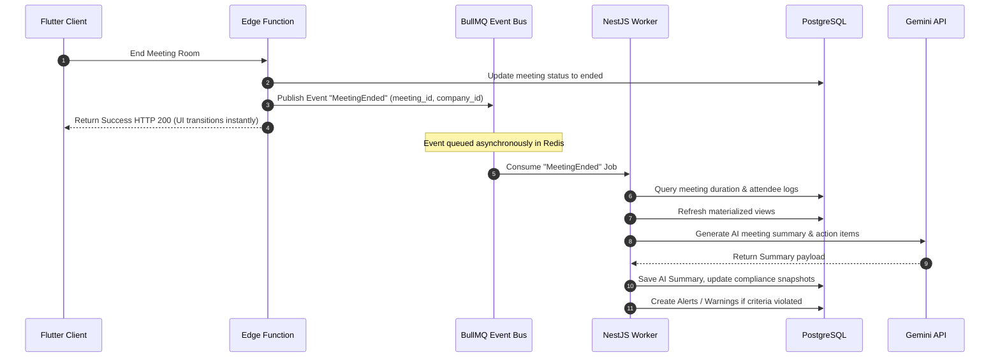

# Ascendra Backend Architecture

This document outlines the multi-tenant system architecture of the Ascendra MLM Leadership SaaS Platform. It provides an overview of the core technologies, service boundaries, data-flow pathways, and the event-driven decoupling strategy.

---

## High-Level Architecture Diagram

The diagram below illustrates the interactions between the Flutter client, Supabase gateway services, the async processing layer, and external integration points, emphasizing the event-driven boundaries.

---

## Service Separation of Responsibilities

To maintain clean architecture, keep performance predictable, and prevent code duplication, the backend divides responsibilities as follows:

### 1. Supabase Edge Functions (Low-Latency Operations)
Edge Functions function as lightweight entry points and webhook receivers. They are stateless, scale to zero, and avoid CPU-heavy work.
- **Responsibilities**:
  - Authenticated thin user actions (e.g., token exchanges, OTP validation checks).
  - Third-party webhook reception (e.g., 100ms video call events, Storage upload complete triggers).
  - Immediate API routing and publishing domain events to the Redis event bus.
- **Key Constraint**: Maximum execution timeout is 15 seconds; memory is capped at 150MB.

### 2. NestJS Application Services (Heavy Workflows & Orchestration)
NestJS runs on Railway as a persistent service container. It serves as our core application server and houses all complex business logic.
- **Responsibilities**:
  - Processing background queues (BullMQ) and scheduled cron tasks.
  - Complex AI workflows (routing skills, building vector search context, prompt construction).
  - Rule-based compliance evaluation loops and decision engines.
  - Recalculating deep hierarchy trees on member terminations.
  - Abstracted notification routing (email, push, and SMS).
- **Key Constraint**: Persistent resource footprints; manages long-running DB connections and Redis subscriptions.

### 3. PostgreSQL Database (Data Integrity & Storage)
PostgreSQL is reserved strictly for storage, constraints, and data security. We avoid embedding business logic in SQL triggers or stored functions unless they relate to data integrity.
- **Responsibilities**:
  - Enforcing multi-tenant isolation through Row-Level Security (RLS).
  - Validating database constraints (e.g., unique indices, check constraints).
  - Handling atomic transactions (e.g., circular company-leader creations).
  - Storing document vectors and index profiles for fast search.

---

## Event-Driven Messaging Strategy

Synchronous execution pathways are decoupled using domain events. When a major state change occurs, the gateway publishes an event to **Upstash Redis**, where **NestJS workers** consume it asynchronously.

### Core Domain Events
- **`MemberInvited`**: Triggers limit auditing and initiates SMS/OTP dispatch.
- **`MeetingEnded`**: Initiates RAG summaries, generates attendance logs, and audits attendance guidelines.
- **`TaskCompleted`**: Triggers proof indexing and dispatches leader notifications.
- **`MemberTerminated`**: Triggers downline tree restructuring and reassigns parent paths.

### De-coupling Example: Meeting Expiry & Summarization

---

## Unified Observability & Telemetry

To ensure system health at 100,000+ user scales, telemetry is collected at critical checkpoints:

1. **RPC Duration**: PostgreSQL execution queries are tracked using custom hooks. Any query taking longer than 250ms is logged as a slow query.
2. **Edge Function Latency**: Request-response spans are sent to the log collector.
3. **Queue Processing Time**: BullMQ logs execution latency and wait times for every job.
4. **100ms Webhook Latency**: Measures the delay between a physical conference room event and when our edge function finishes processing it.
5. **AI Round-Trip Time**: Saves latency measurements for Gemini APIs in `ai_context_logs` and `ai_usage_logs` to isolate model delays from application processing.
