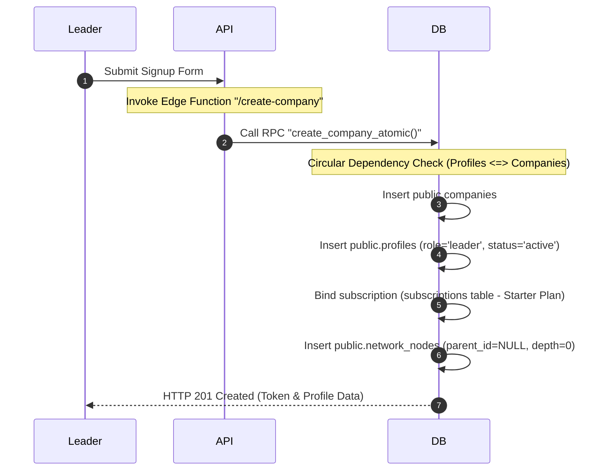
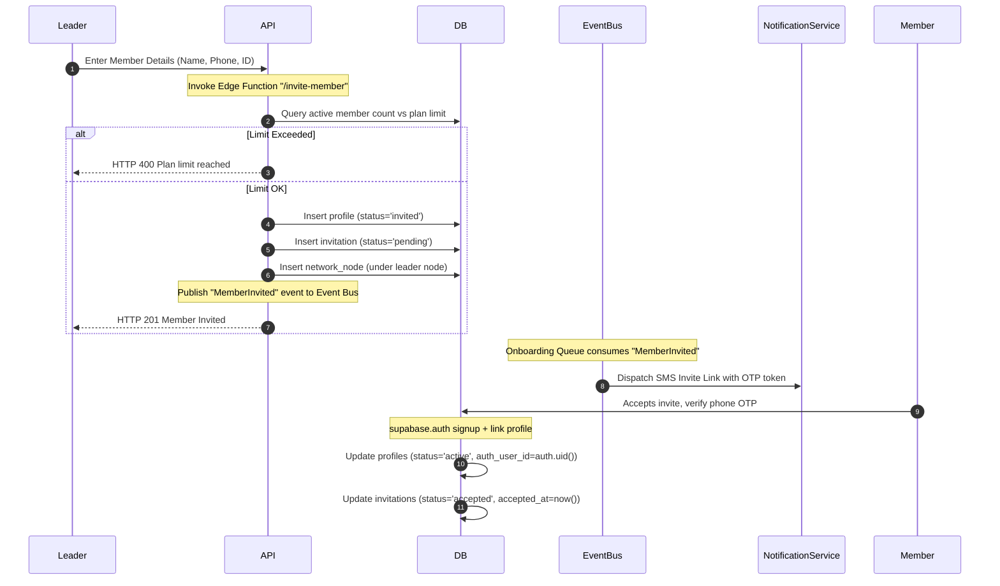
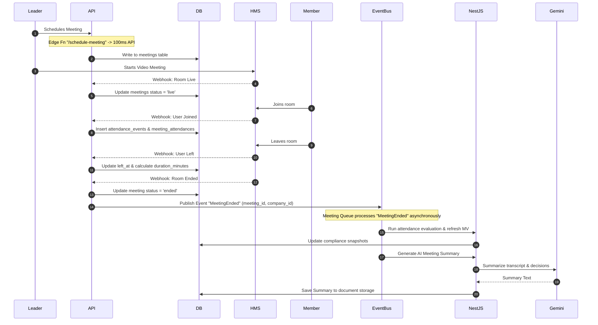
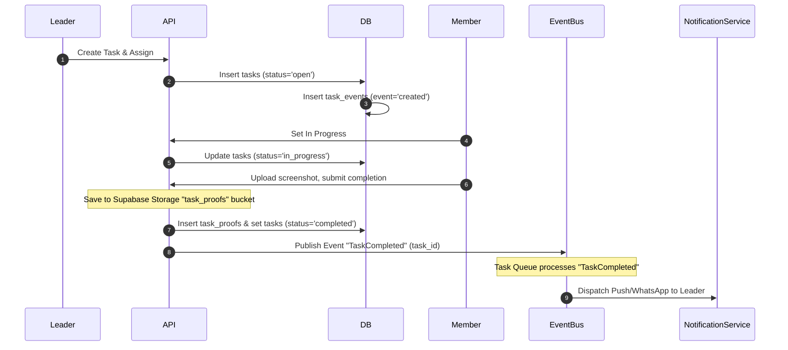
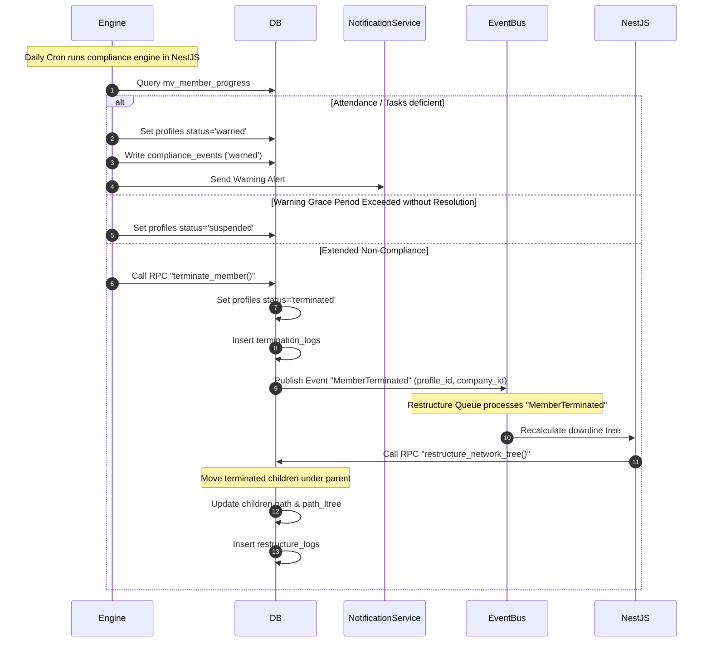

# Ascendra Backend User Journey Mapping

This document maps core user journeys to the underlying database state changes, transaction flows, and backend event-driven processing steps.

---

## Journey 1: Leader Signup & Company Setup

This journey establishes the root company tenant and its primary leader profile.

### Step-by-Step Flow

### Backend State Map

| Actions | Affected Tables | Key Column Changes | Triggers / Side Effects |
|---|---|---|---|
| Initiate signup | `companies`, `profiles` | `companies.owner_id` set to profile uuid; `profiles.company_id` set to company uuid. | Constraints set to `INITIALLY DEFERRED` to prevent circular dependency errors. |
| Allocate plan | `subscriptions` | `status = 'active'`, `expires_at = now() + interval '30 days'` | `check_subscription_leader` trigger asserts that profile has the leader role. |
| Setup tree | `network_nodes` | `parent_id = null`, `depth = 0`, `path = <profile_uuid>` | GiSt index tracks node. `path_ltree` generated from path. |

---

## Journey 2: Leader Invites Member & Onboarding Completion

This journey details the onboarding flow, which uses phone-based OTP verification for security.

### Step-by-Step Flow

### Backend State Map

| Actions | Affected Tables | Key Column Changes | Triggers / Side Effects |
|---|---|---|---|
| Leader submits invite | `profiles`, `invitations` | `profiles.status = 'invited'`; `invitations.status = 'pending'` | Slot consumed. System counts `invited` profiles in plan limit check to prevent over-invitations. |
| Event emitted | `invitations` | `expires_at = now() + interval '7 days'` | `MemberInvited` event is pushed to Upstash Redis. Onboarding worker picks it up for SMS sending. |
| Member signs up | `auth.users`, `profiles` | `profiles.auth_user_id` linked, `profiles.status = 'active'` | RLS updates. Member can now query other tables within their company. |

---

## Journey 3: Video Meeting & Attendance Compliance Auditing

This journey tracks compliance requirements (e.g., minimum duration and frequency) for team video calls, using asynchronous event evaluation.

### Step-by-Step Flow

### Backend State Map

| Actions | Affected Tables | Key Column Changes | Triggers / Side Effects |
|---|---|---|---|
| Create meeting | `meetings` | `status = 'scheduled'`, `room_id = '100ms-uuid'` | Generated token lets leader launch meeting. |
| User joins | `attendance_events`, `meeting_attendances` | `attendance_events.event_type = 'join'`, `meeting_attendances.joined_at = now()` | Real-time dashboards update. |
| User leaves | `attendance_events`, `meeting_attendances` | `attendance_events.event_type = 'leave'`, `meeting_attendances.duration_minutes = delta` | Calculates cumulative connection time across disconnects. |
| Meeting ends | `meetings`, `compliance_snapshots` | `meetings.status = 'ended'` | Publishes `MeetingEnded` domain event. Subscribed jobs calculate metrics and call Gemini. |

---

## Journey 4: Task Verification Flow

This journey tracks work proof verification for tasks assigned by leaders.

### Step-by-Step Flow

### Backend State Map

| Actions | Affected Tables | Key Column Changes | Triggers / Side Effects |
|---|---|---|---|
| Assign task | `tasks`, `task_events` | `status = 'open'`, `assigned_to = member_uuid` | Triggers a push notification to the member. |
| Submit proof | `task_proofs`, `tasks` | `tasks.status = 'completed'`, `task_proofs.file_url = <url>` | Asserts that `completed_at` is set when status is updated to `'completed'`. |

---

## Journey 5: Compliance Warn, Suspend & Restructure Pipeline

This diagram shows how compliance violations escalate to member termination and MLM tree restructuring.

### Step-by-Step Flow

### Backend State Map

| Actions | Affected Tables | Key Column Changes | Triggers / Side Effects |
|---|---|---|---|
| Warning issued | `profiles`, `compliance_events` | `profiles.status = 'warned'`, `warned_at = now()` | Grace period countdown starts. |
| Terminated | `profiles`, `termination_logs` | `profiles.status = 'terminated'`, `terminated_at = now()` | Blocks user from accessing the system. |
| Restructure | `network_nodes`, `restructure_logs` | `network_nodes.parent_id = upline_parent_uuid`, `path = updated_materialized_path` | GiST tree indexes update. Recalculates downline counts for all nodes in the path. |
