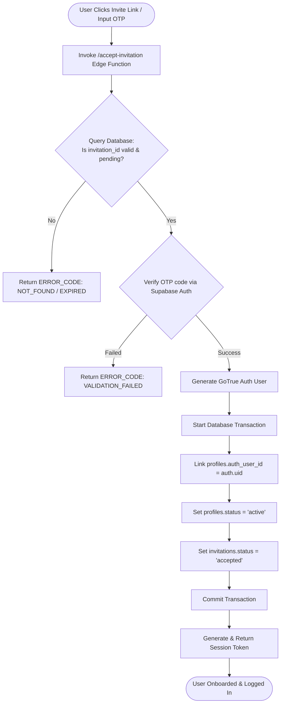
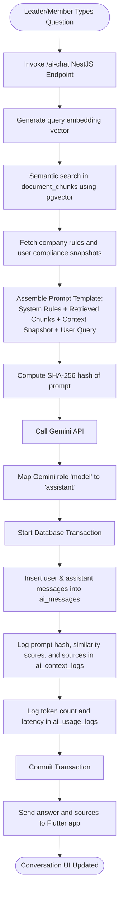
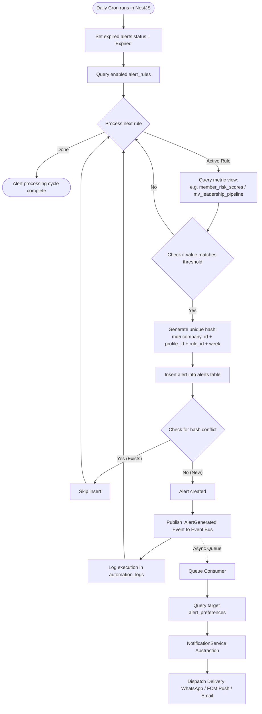
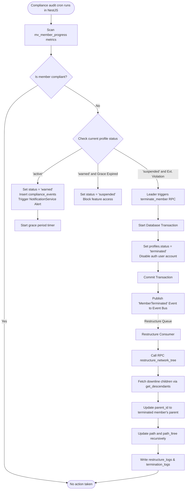

# Ascendra Backend User Flow Diagrams

This document contains flowcharts of core backend workflows, showing state transitions, validation checks, and asynchronous event-driven updates.

---

## 1. Member Onboarding & Invitation Flow

This flow diagram illustrates how invited members activate their account using phone-based OTP verification.

---

## 2. AI Assistant RAG Chat Workflow (Phase F0)

This flowchart shows how semantic queries, database lookups, and Gemini API calls are coordinated with context logging in the NestJS application layer.

---

## 3. Decision & Alert Engine Flow

This flowchart shows how rules are processed, alerts are deduplicated, and notifications are sent asynchronously through our Event Bus.

---

## 4. Compliance Warning & Event-Driven Restructuring

This flowchart shows how non-compliant behavior triggers warnings and terminations, and how hierarchy restructuring is offloaded to background queues.

